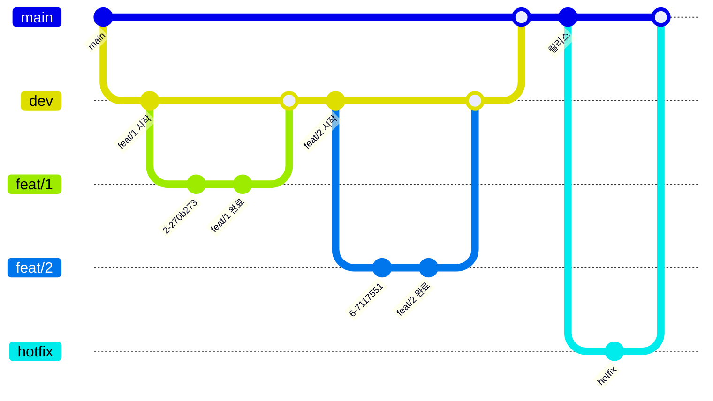

# 📚 DEV.md

이 문서는 chukapoka 프로젝트를 시작하는 사람들을 위한 가이드입니다.

## 📌 Git 브랜치 전략 시각화

---

### 브랜치 규칙

- main: 릴리즈된 배포 코드

- dev: 개발자들의 작업 병합용 브랜치

- feat/#번호: 기능 개발 단위 브랜치

- hotfix: 배포 이후 긴급 패치 브랜치

### 머지 조건

- main, develop 브랜치에는 PR 리뷰어의 Approve가 있어야 머지 가능

- PR에는 반드시 관련 이슈를 연결하고, 라벨(feature, bugfix, docs 등)을 붙여주세요


## 💡 Git 주기적 fetch 왜 필요해요?


- fetch는 원격 저장소의 변경사항을 가져오기만 합니다 (자동 병합 ❌)

- 최신 상태 유지를 위해 주기적으로 해주세요

- dev 브랜치는 주기적으로 fetch 필요

- 현재 작업 브랜치는 최신 dev 브랜치에서 따왔다면 fetch는 작업 시작전에 1회 필요 

- fetch 이후 현재 나의 로컬 파일과 차이가 존재한다면 pull 할 것.

## 📄 SwiftLint 설정 (실리콘 Mac 기준)

### 1. SwiftLint 설치

```
brew install swiftlint
```

### 2. Xcode Build Phase에 Run Script에 추가

**2.1** 프로젝트 파일 선택


**2.2** 프로젝트 타겟 선택


**2.3** Run Script Phase 생성


**2.4** Run Script 파일 설정


### 3. SwiftLint 설정 참고 PR

어떠한 SwiftLint 룰이 설정되어있는지 읽어보시면 좋을듯함.
> 👉 [SwiftLint 룰 제안 PR #8](https://github.com/DeveloperAcademy-POSTECH/2025-C3-M13-TeamGyeongjosa/pull/8)

## 🎨 공용 스타일 적용 방법

### 📁 Resources/GSFont.swift

```swift
Text("제목")
  .font(GSFont.title1)
```

### 📁 Resources/GSColor.swift

```swift
.background(GSColor.primary)
.foregroundStyle(GSColor.white)
```

## 🧩 공용 컴포넌트 사용법

### PrimaryButton

```swift
PrimaryButton(
  title: "다음",
  style: .custom(textColor: GSColor.white, backgroundColor: GSColor.primary, isEnable: true),
  action: { print("다음 클릭") }
)
.padding(.horizontal, 16) // 해당 패딩이 양옆 마진값 설정 가능
```

### PairButton

```swift
PairButton(
  leftTitle: "그룹 생성하기",
  rightTitle: "코드로 참여하기",
  leftStyle: .custom(textColor: GSColor.primary, backgroundColor: GSColor.secondary3, isEnable: true),
  rightStyle: .custom(textColor: GSColor.white, backgroundColor: GSColor.primary, isEnable: true),
  leftAction: { print("그룹 생성") },
  rightAction: { print("참여") }
)
.padding(.horizontal, 16) // 양옆 패딩

// 내부 버튼 2개의 뷰 사이 마진값은 8로 고정해둠. 필요시 요청
```

## 🗂️ GitHub Issue/PR 작성 규칙

### 📌 Issue 템플릿 작성 규칙

New Issue 버튼 누른 이후 템플릿 참조

> Assignees - 담당자 본인 선택

> 라벨 필수

### ✅ PR 작성 규칙

> ⚠️ 주의 아래 리뷰어 YooGyeongMo 혹은 다른 테크분들 설정 필수

> Assignees - 담당자 본인 선택

> UI 관련 스크린샷 참고 가능

> PR 템플릿은 전체적인 구조는 따르되 필요없는 것은 수정 가능.

## 📦 SwiftData 모델링 (ERD 기반)


## 🧾 Swift 코드 컨벤션

📎 참고 링크: [DeveloperAcademy-POSTECH Swift Style Guide](https://github.com/DeveloperAcademy-POSTECH/swift-style-guide)

이 프로젝트는 DeveloperAcademy-POSTECH Swift 스타일 가이드를 따릅니다.

### 주요 가이드 요약

```
CamelCase 네이밍

View 이름은 View, ViewModel 등 접미어 붙이기

magic number → 상수화

접근 제어자 명시 (private 등)

body가 짧아도 {} 사용 권장
```

## ✅ Commit 메시지 컨벤션

형식: [타입] 작업한 요약 메시지

```
Feat 새로운 기능 추가

Fix 버그 수정

Refactor 리팩토링 (기능 변경 없음)

Docs 문서 작성 및 수정

Style 코드 포맷팅, 세미콜론 등

Test 테스트 코드 추가/수정

Chore 기타 변경 (빌드 설정, 린트 등)

```